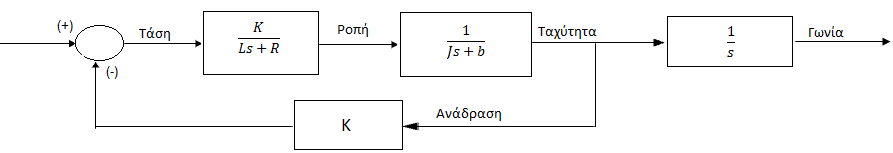
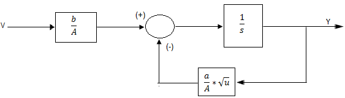

## 					Τεχνική Αναφορά

Για να καταφέρουμε να περιγράψουμε και να αναλύσουμε την ηλεκτρική αντλία και την δεξαμενή νερού θα χρησιμοποιηθούν τα διαγράμματα βαθμίδων (Block Diagrams) , ώστε να γίνει με πιο σαφή τρόπο η βηματική ροή του συστήματος. Η ροπή της αντλίας εξαρτάται από το ρεύμα οπλισμού και το μαγνητικό πεδίο. Οπότε θεωρούμε ότι το μαγνητικό πεδίο είναι σταθερό. Συνεπώς έχουμε την εξίσωση :

				`Τ=K_t*i`    
Εξίσωση 1.1

Όπου i το ρεύμα οπλισμού και  K_t η ισχύς του μαγνητικού πεδίου. Η εξίσωση η οποία διέπει το σύστημα για την αντλία, προκύπτει από τον νόμο του Kirchhoff για τάσεις. Η εξίσωση αυτή είναι η εξής :

   			`L di/dt+R*i=V-Κθ` ̇      
Εξίσωση 1.2

Παράλληλα προκύπτει η εξίσωση ηλεκτρομαγνητικής δύναμης η οποία εξαρτάται από την γωνιακή ταχύτητα του οπλισμού και φαίνεται πιο κάτω:

				`e=Kbθ `̇    
Εξίσωση 1.3

Στην οποία εάν εφαρμοστεί ο δεύτερος νόμος του Νεύτωνα η σχέση γίνεται:

			`Jθ ̈+ bθ ̇= Ki`    
Εξίσωση 1.4

Έπειτα εφαρμόζοντας μετασχηματισμό Laplace  στην εξίσωση 1.2 και 1.4 μπορούν να εκφραστούν βάσει της μεταβλητής Laplace(s).

			`s*(Js+b)*Θ(s)=K*I(s)`   
Εξίσωση 1.5

			`(Ls+R)*I(s)=V(s)-Ks*Θ(s)`   
Εξίσωση 1.6

Απλοποιώντας το ρεύμα και παραγωγίζοντας ως προς την ταχύτητα (rad / sec) η τελική μορφή της εξίσωσης μεταφοράς της αντλίας είναι:

	`(Θ(s))/(V(s))=K/(s*((Js+b)*(Ls+R)+K^2))`      
Εξίσωση 1.7

Το διάγραμμα βαθμίδων ανοιχτού βρόγχου της αντλίας παρουσιάζεται  στην παρακάτω εικόνα :

Στην παρακάτω εξίσωση το G(s) είναι για την συνάρτηση μεταφοράς της αντλίας, το H(s) είναι η συνάρτηση μεταφοράς της δεξαμενής νερού και το Κ είναι η ανάδραση.

####	N(s)=G(s)*H(s)    
Εξίσωση 1.11

Με την ανάδραση Κ προκύπτει η παρακάτω εξίσωση:

#### U(s)=(G(s)*H(s))/(1+((G(s)*H(s) )*K))   Εξίσωση 1.12

Από την εργασία που υλοποιήθηκε για το μάθημα EG5142 Control & electrical Systems συμπεραίνουμε ότι με έναν απλό αισθητήρα και ένα κινητήρα μπορούμε να σταματήσουμε ή να συνεχίσουμε την ροή νερού σε μια δεξαμενή. Ο αισθητήρας που θα έχει τοποθετηθεί μέσα στην δεξαμενή θα είναι αυτός που θα κρίνει το πότε πρέπει να σταματήσει ο κινητήρας να τροφοδοτεί με νερό την δεξαμενή.

Τα προβλήματα που μπορούν να προκληθούν είναι ότι, αν η διατομή του σωλήνα που εισέρχεται το νερό στην δεξαμενή, σε σχέση με την διατομή του σωλήνα όπου εξέρχεται το νερό είναι μικρότερη, τότε θα έχουμε μια μη ισορροπημένη εισροή και εκροή νερού από την δεξαμενή.
Αυτό θα είχε ως αποτέλεσμα ότι η δεξαμενή θα άδειαζε πολύ πιο γρήγορα από ότι θα γέμιζε. Το ίδιο θα ίσχυε αν γινόταν το αντίστροφο, μόνο που η διαφορά θα ήταν ότι η δεξαμενή θα γέμιζε πλήρως πριν προλάβει να αδειάσει.

Το πλεονέκτημα του συστήματος αυτού είναι ότι είναι αυτοματοποιημένο με αποτέλεσμα να μην χρειάζεται η συνεχή ανθρώπινη παρέμβαση για των ελέγχω της δεξαμενής ώστε να πρέπει να αποφασίσει αν θα σταματήσει ή όχι την παροχή νερού.

Ένας εναλλακτικός τρόπος επίλυσης του προβλήματος θα ήταν η τοποθέτηση ενός χρονοδιακόπτης. Ο χρονοδιακόπτης αυτός θα άνοιγε τις βάνες εισροής και εκροής του νερού και θα έκλεινε τις βάνες όταν ο χρόνος τελείωνε. Ο χρόνος στον οποίο θα έμενε ανοιχτός θα είχε προκαθοριστεί με βάση τον όγκο της δεξαμενής αλλά και το πόσο η γρήγορα ή αργά θα γέμιζε αυτή. 
